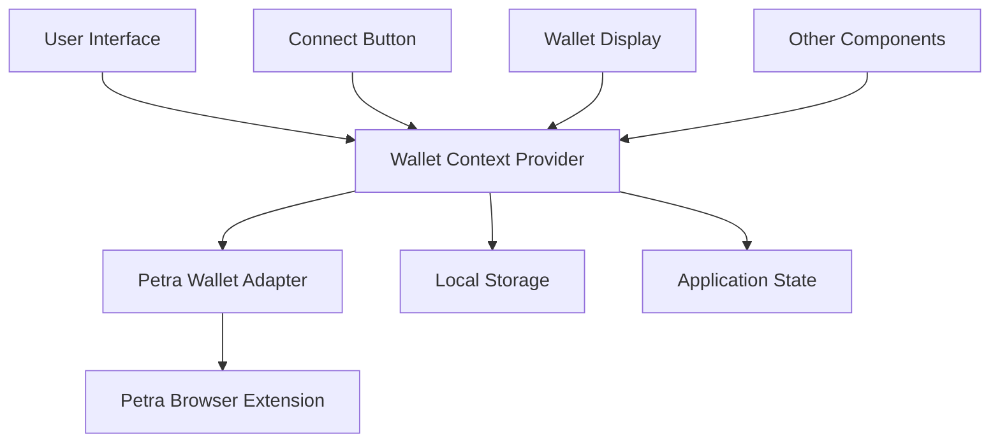
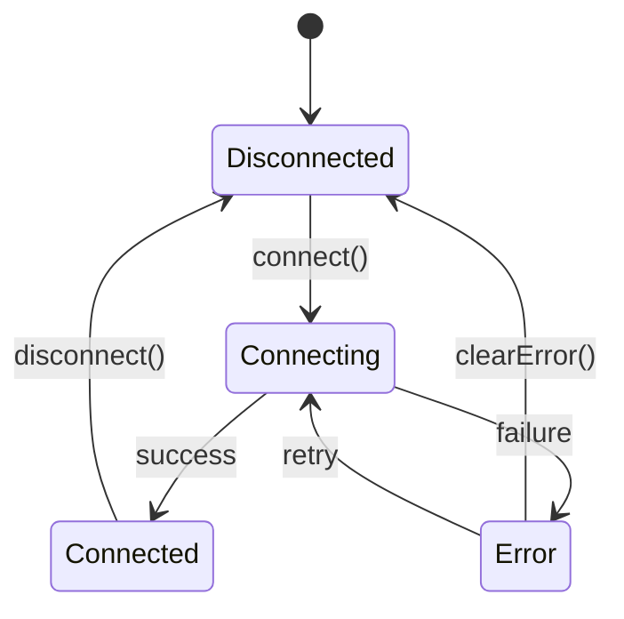

# Design Document

## Overview

The Petra wallet integration will be implemented as a React context-based solution that provides wallet connection, state management, and utility functions throughout the application. The design follows modern React patterns with TypeScript for type safety and includes proper error handling and user experience considerations.

## Architecture

### High-Level Architecture



### Component Hierarchy

- **WalletProvider**: Top-level context provider
- **WalletConnectButton**: Reusable connect/disconnect button component
- **WalletDisplay**: Shows connected wallet information
- **useWallet**: Custom hook for accessing wallet state
- **WalletAdapter**: Abstraction layer for Petra wallet interactions

## Components and Interfaces

### WalletProvider Context

```typescript
interface WalletContextType {
  // Connection state
  isConnected: boolean;
  isConnecting: boolean;
  account: string | null;
  network: string | null;
  
  // Actions
  connect: () => Promise<void>;
  disconnect: () => void;
  
  // Error handling
  error: string | null;
  clearError: () => void;
}
```

### Wallet Adapter Interface

```typescript
interface WalletAdapter {
  connect(): Promise<{
    address: string;
    publicKey: string;
    network: string;
  }>;
  
  disconnect(): Promise<void>;
  
  isConnected(): boolean;
  
  getAccount(): Promise<string | null>;
  
  getNetwork(): Promise<string>;
  
  onAccountChange(callback: (account: string) => void): void;
  
  onNetworkChange(callback: (network: string) => void): void;
}
```

### Component Props

```typescript
interface WalletConnectButtonProps {
  variant?: 'default' | 'outline' | 'ghost';
  size?: 'sm' | 'md' | 'lg';
  className?: string;
  onConnect?: () => void;
  onDisconnect?: () => void;
}

interface WalletDisplayProps {
  showFullAddress?: boolean;
  showNetwork?: boolean;
  className?: string;
}
```

## Data Models

### Wallet State

```typescript
interface WalletState {
  isConnected: boolean;
  isConnecting: boolean;
  account: string | null;
  network: string | null;
  error: string | null;
  lastConnected: number | null;
}
```

### Connection Result

```typescript
interface ConnectionResult {
  success: boolean;
  account?: string;
  network?: string;
  error?: string;
}
```

### Network Configuration

```typescript
interface NetworkConfig {
  name: string;
  chainId: string;
  rpcUrl: string;
  supported: boolean;
}
```

## Error Handling

### Error Types

1. **WalletNotInstalledError**: Petra wallet extension not found
2. **ConnectionRejectedError**: User rejected connection request
3. **NetworkUnsupportedError**: Connected to unsupported network
4. **WalletLockedError**: Wallet is locked and needs to be unlocked
5. **UnknownError**: Generic error for unexpected issues

### Error Recovery Strategies

- **Auto-retry**: For temporary connection issues
- **User guidance**: Clear instructions for resolving common issues
- **Graceful degradation**: Application remains functional without wallet
- **Error boundaries**: Prevent wallet errors from crashing the app

### Error Messages

```typescript
const ERROR_MESSAGES = {
  WALLET_NOT_INSTALLED: 'Petra wallet is not installed. Please install it from the Chrome Web Store.',
  CONNECTION_REJECTED: 'Wallet connection was rejected. Please try again.',
  NETWORK_UNSUPPORTED: 'Please switch to a supported network in your Petra wallet.',
  WALLET_LOCKED: 'Please unlock your Petra wallet and try again.',
  UNKNOWN_ERROR: 'An unexpected error occurred. Please try again.'
};
```

## State Management

### Context State Flow



### Local Storage Persistence

- Store connection preference
- Cache last connected account
- Remember user's network preference
- Clear sensitive data on disconnect

## Integration Points

### Existing Components Integration

1. **Navigation**: Add wallet button to header/navigation
2. **User Profile**: Display wallet info in user sections
3. **Transaction Components**: Access wallet for signing
4. **Theme Integration**: Match existing design system

### shadcn/ui Components Used

- Button: For connect/disconnect actions
- Dialog: For connection modals
- Toast: For notifications and errors
- Tooltip: For address display
- Badge: For network status

## Security Considerations

### Best Practices

1. **Never store private keys**: Only store public addresses
2. **Validate all inputs**: Sanitize wallet addresses and network data
3. **Secure communication**: Use HTTPS for all wallet interactions
4. **Permission management**: Request minimal necessary permissions
5. **Session management**: Implement proper session timeouts

### Data Protection

- No sensitive data in localStorage
- Clear wallet data on disconnect
- Validate wallet responses
- Implement CSP headers for extension security

## Performance Considerations

### Optimization Strategies

1. **Lazy loading**: Load wallet adapter only when needed
2. **Memoization**: Cache wallet state and expensive operations
3. **Debouncing**: Prevent excessive wallet queries
4. **Connection pooling**: Reuse wallet connections efficiently

### Bundle Size Impact

- Tree-shake unused Aptos SDK features
- Use dynamic imports for wallet adapter
- Minimize dependencies
- Optimize for production builds

## Testing Strategy

### Unit Tests

- Wallet context state management
- Custom hooks functionality
- Error handling scenarios
- Component rendering states

### Integration Tests

- Wallet connection flow
- Network switching behavior
- Error recovery mechanisms
- Component interactions

### E2E Tests

- Complete wallet connection journey
- Cross-browser compatibility
- Extension interaction testing
- User experience validation

### Mock Strategy

```typescript
interface MockWalletAdapter {
  mockConnect: (result: ConnectionResult) => void;
  mockDisconnect: () => void;
  mockNetworkChange: (network: string) => void;
  mockError: (error: string) => void;
}
```

## Accessibility

### WCAG Compliance

- Keyboard navigation support
- Screen reader compatibility
- High contrast mode support
- Focus management
- ARIA labels and descriptions

### User Experience

- Clear loading states
- Descriptive error messages
- Consistent interaction patterns
- Mobile-responsive design
- Reduced motion support